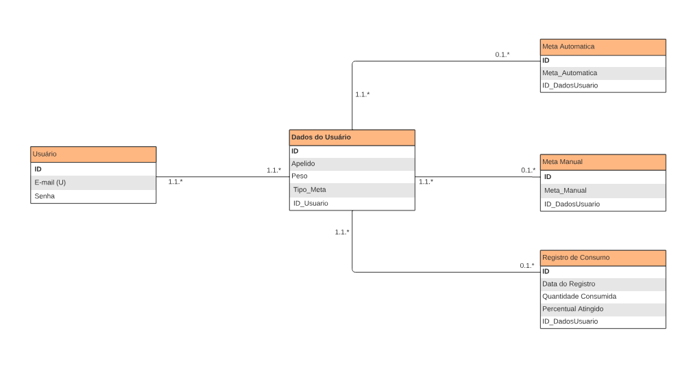
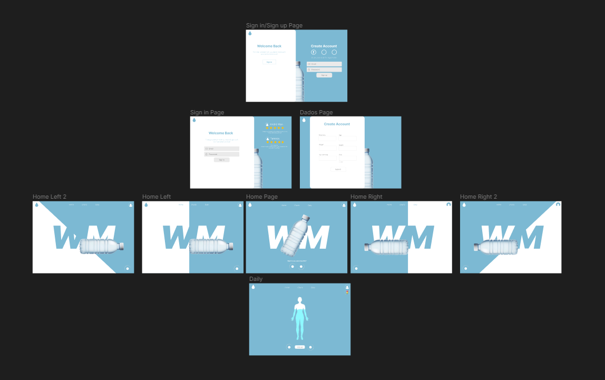
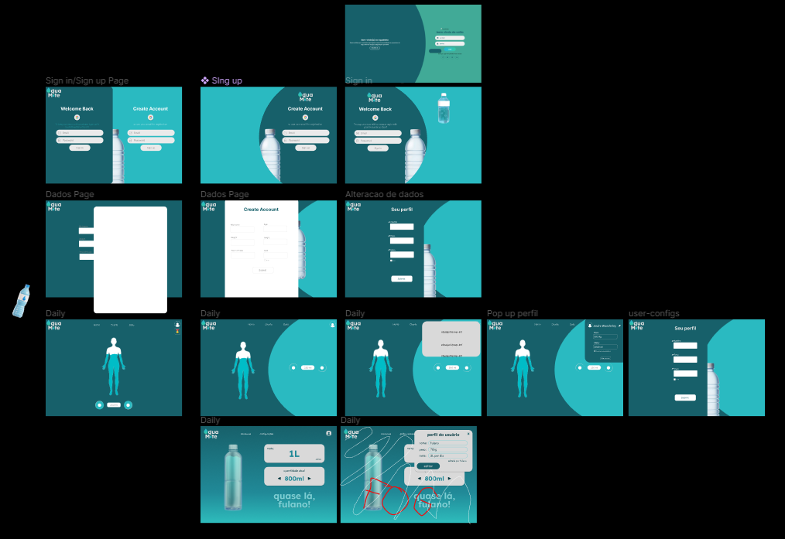

<h1 align="center">AquaMate</h1>

## 1. Visão Geral do Projeto

**Nome do Projeto:** AquaMate  
**Objetivo Principal:** Facilitar a contabilização da água ingerida diariamente pelo usuário.  
**Descrição:** AquaMate é uma aplicação web destinada a monitorar e contabilizar a ingestão diária de água dos usuários, ajudando-os a atingir suas metas de hidratação.  
**Público-Alvo:** Livre para todos os públicos.

## 2. Requisitos e Especificações

### Requisitos Funcionais

- **Login/Cadastro:** Permite que usuários se registrem com email e senha, e façam login para acessar suas informações.
- **Dashboard:** Exibe a quantidade de água ingerida diariamente pelo usuário.
- **Configurações do Usuário:** Permite ao usuário alterar seus dados pessoais e metas de consumo de água.
- **Usabilidade:** Interface intuitiva e fácil de usar (em melhoria).
- **Desempenho:** Resposta rápida para melhor experiência do usuário.

### Restrições e Premissas

- Deve ser compatível com os principais navegadores web.
- Necessidade de acesso à internet.

## 3. Arquitetura do Sistema

### Diagrama de Arquitetura

### Tecnologias Utilizadas

- **Frontend:** HTML, CSS, JavaScript
- **Backend:** Java, Spring Boot
- **Banco de Dados:** MySQL em RDS
- **Nuvem:** AWS EC2

## 4. Desenvolvimento

### Ambiente de Desenvolvimento

- **IDE:** Visual Studio Code
- **IDE:** IntelliJ community
- **Design:** Figma
- **Controle de Versão:** GitHub
- **Diagramas:** Lucidchart

### Configuração do Ambiente de Desenvolvimento

1. **Instalar Visual Studio Code:** [Visual Studio Code](https://code.visualstudio.com/)
2. **Instalar IntelliJ IDEA Community:** [IntelliJ IDEA Community](https://www.jetbrains.com/idea/download/)
3. **Instalar Java JDK:** [Java JDK](https://www.oracle.com/java/technologies/javase-jdk11-downloads.html)
4. **Instalar Spring Boot CLI:** [Spring Boot](https://spring.io/tools)
5. **Configurar MySQL:** [MySQL](https://dev.mysql.com/downloads/installer/)

## 5. Implementação

### Estrutura do Projeto

- **Frontend:** `/Aquamate/frontend`
- **Backend:** `/Aquamate/backend/Aquamate`
- **Banco de Dados:** `/Aquamate/sql`

### Principais Funcionalidades

- **Login/Cadastro:** Verificação e autenticação de usuários.
- **Dashboard:** Monitoramento e exibição do consumo diário de água.
- **Configurações do Usuário:** Atualização de dados e metas.

## 6. Testes

### Estratégia de Teste

- **Unitários:** Testar funcionalidades individuais.
- **Integração:** Verificar a interação entre diferentes componentes do sistema.
- **Funcionais:** Validar as funcionalidades do sistema conforme requisitos.

### Ferramentas de Teste Utilizadas

- Postman

## 7. Deploy e Manutenção

### Processo de Deploy

1. **Configurar o servidor:** Provisionar um servidor com Java e MySQL instalados.
2. **Deploy do Backend:** Fazer upload dos arquivos do Spring Boot para o servidor.
3. **Deploy do Frontend:** Fazer upload dos arquivos HTML, CSS e JavaScript para o servidor.

### Ambiente de Produção

- Servidor com sistema operacional Ubuntu.
- Banco de dados MySQL configurado para produção.

## 8. Documentação do Usuário

### Manual do Usuário

1. **Cadastro:** Preencha o formulário de cadastro com email, senha, apelido, peso e tipo de meta.
2. **Login:** Insira email e senha para acessar a aplicação.
3. **Dashboard:** Visualize a quantidade de água ingerida e a meta diária.
4. **Configurações:** Altere suas informações pessoais e metas conforme necessário.

## 9. Equipe e Gerenciamento do Projeto

### Membros da Equipe e Seus Papéis

- **Administrador(es) de banco de dados (DBA):** [André Wanderley Porto](https://github.com/Andrewanport), [Fábio Rangel](https://github.com/fabiords07).
- **Desenvolvedor(es/as) Frontend:** [Ana Carolina Queiroga](https://github.com/carolinaqueiroga), [André Wanderley Porto](https://github.com/Andrewanport), [Fábio Rangel](https://github.com/fabiords07), [Juan Pablo](https://github.com/pablobdss), [Tamires Carvalho](https://github.com/carvalhotamires).
- **Desenvolvedor(es/as) Backend:** [Fábio Rangel](https://github.com/fabiords07), [Juan Pablo](https://github.com/pablobdss), [Lucas Guimarães](https://github.com/guima11).
- **Designer(s):** [Ana Carolina Queiroga](https://github.com/carolinaqueiroga), [André Wanderley Porto](https://github.com/Andrewanport), [Tamires Carvalho](https://github.com/carvalhotamires).

## 10. Anexos e Referências

### Documentos Adicionais Relevantes  

1. **Processo de criação de telas**

                 
